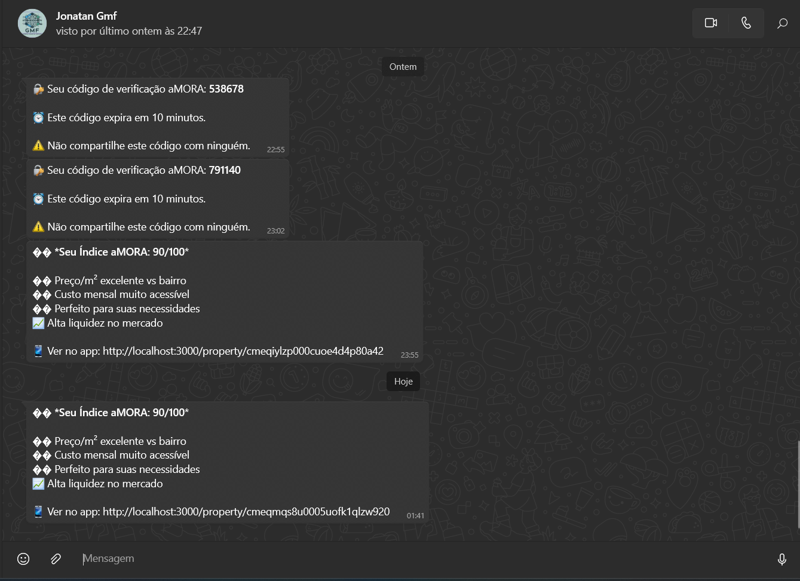
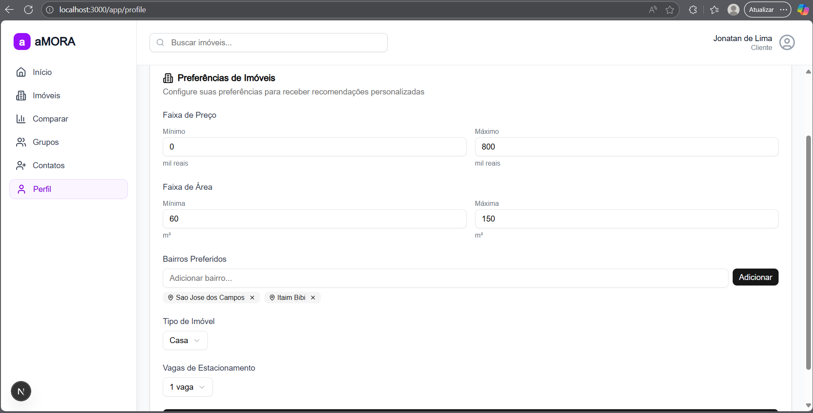
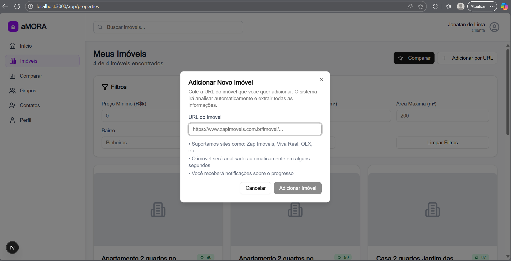
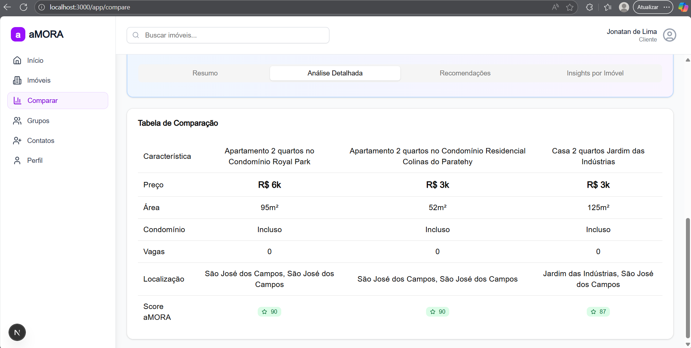
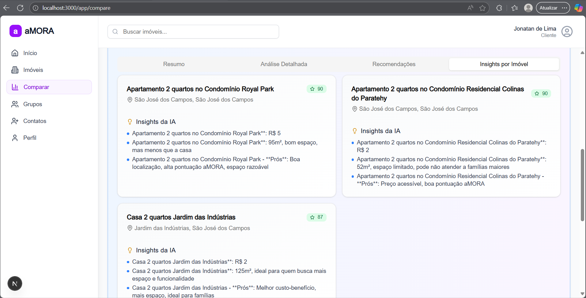
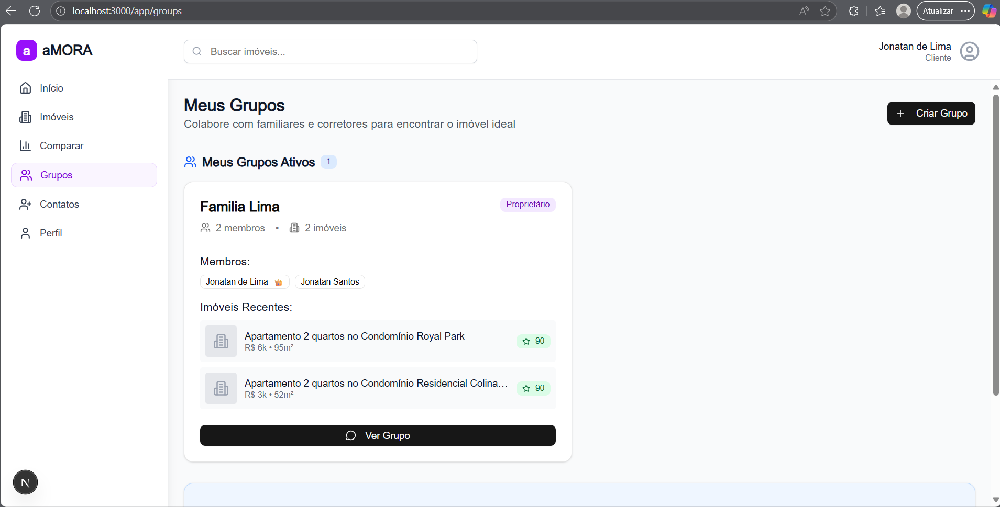
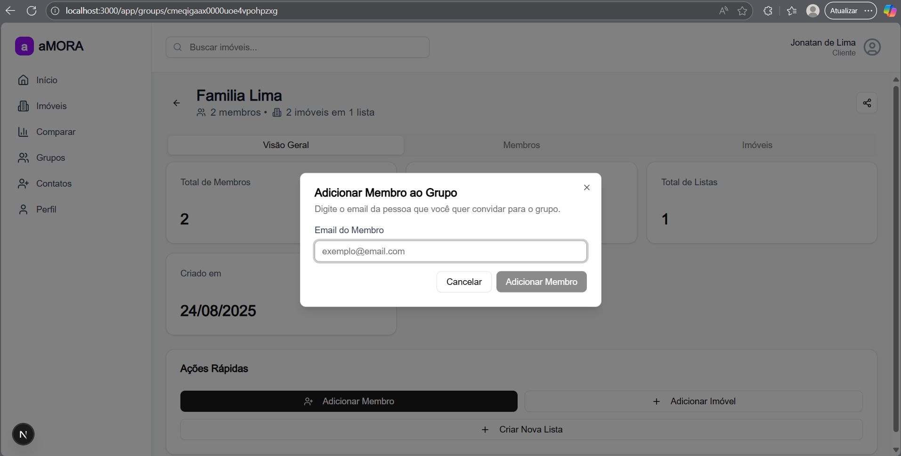
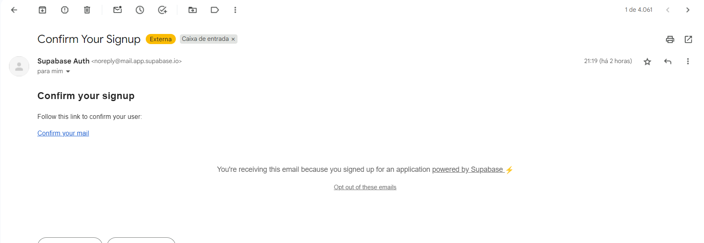
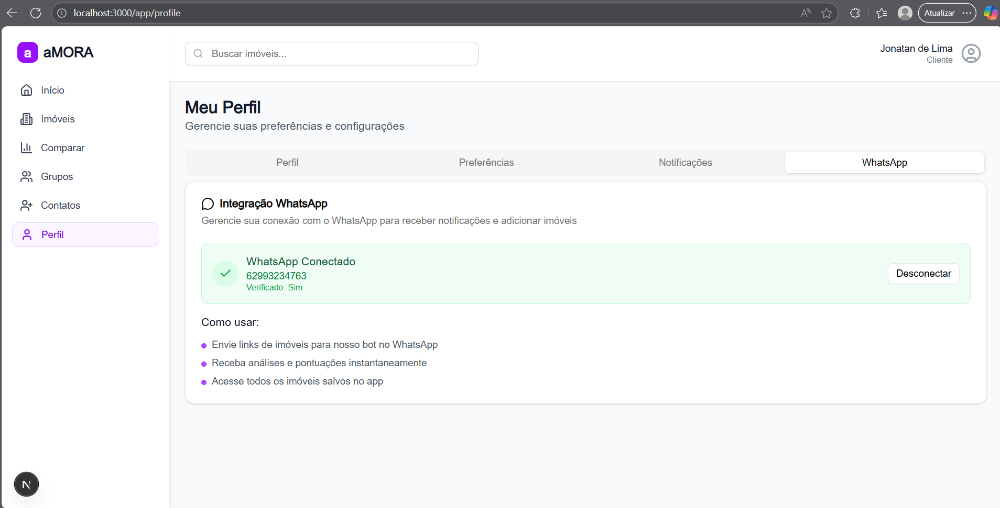

# aMORA - MVP WhatsApp para Imóveis

Uma plataforma inteligente para análise e gestão de imóveis com integração WhatsApp, desenvolvida em Next.js 15 e TypeScript.

## 🚀 Como Rodar

### Pré-requisitos
- Node.js 18+
- Docker e Docker Compose
- PostgreSQL
- Redis

### 1. Configurar variáveis de ambiente
```bash
cp env.example .env
# Preencher as variáveis necessárias (Supabase, OpenAI, Evolution API)
```

### 2. Subir infraestrutura
```bash
cd evolution-api
docker-compose up -d
```

### 3. Instalar dependências e rodar
```bash
npm install
npm run dev
```

Acesse: http://localhost:3000

---

# Problemas identificados e propostas de solução

## 1. Desorganização da busca de imóveis

**Como é atualmente:** Leads organizam imóveis em prints, grupos de whatsapp, notas soltas. Fica difícil lembrar do que viu e comparar opções. 

**Como será na solução:** O usuário enviará o link por whatsapp para o bot. O bot fará uma análise e:

1. Trará **insigths imediatos** via whatsapp, junto a uma **pontuação** e resumo de **características importantes**.
2. **Adicionará no banco de dados**, e ficará disponível para o usuário na interface. 

Além disso, no portal, haverá um **botão para comparar imóveis** selecionados dentre os adicionados, utilizando IA. Assim, resolvendo o problema do salvamento e comparação entre imóveis. 

É importante observar que o usuario poderá adicionar preferencias se logado, que podem servir para a IA trazer uma melhor análise dos imóveis fronecidos.

Pensou-se também em um sistema de pontuação aMORA para facilitar a comparação. 

Tanto o envio de uma mensagem com um link por whatsapp resultará em uma análise feita pelo bot, como uma adição na propria interface também resultará em uma mensagem por whatsapp. 













---

## 2. Falta de engajamento contínuo 

**Como é atualmente:** Leads somem. Apenas voltam se acham algo sozinhos. 

**Como será na solução:** O corretor tem uma aba em que pode enviar "pedido de amizade" para o Lead, apenas em posse do seu email. Na mesma interface, há a possibilidade de escolher template e um imovel adicionado por ele mesmo e enviar para o Lead, o que resultaria na ativação. 


**Ideia extra:** Uma vez por semana rodará um cron job para **buscar imóveis similares** aos adicionados e respeitando as características informadas na plataforma(personalização das necessidades do usuário). 

Os imóveis encontrados são enviados com o devido detalhamento e link por whatsapp, para o usuário escolher quais adicionar ou não. **Isso resultará na ativação do Lead**. Infelizmente essa ideia não foi implementada por falta de tempo. 


---

## 3. Dificuldade de colaboração

**Como é feito atualmente:** Jornada de compra é feita por múltiplas pessoas. Cada um salva e compartilha de um jeito. 

**Como será na solução:** **Haverá grupos**, que podem conter somentes usuários, mas também usuários e corretores. E sempre que o usuário se inserir em um grupo, **todos imóveis adicionados** por ele serão imediamente considerados do grupo. 

A criação do grupo será através de do email de cada pessoa a colaborar. Neste MVP, a pessoa deve possuir login na pltafaorma e assim receberá o convite. 

**Ideia extra:** Cada imóvel compartilhado poderá ter **reações e comentários** de cada participante do grupo. Deve vir com a informação de quem adicionou. Outra ideia é a criação do grupo ser simplificada através de um link de compartilhamento mas por falta de tempo não foi possível implementar.





---

## 4. Corretores sem ferramentas para apresentar a aMORA

**Como é feito atualmente:** Corretor quer ajudar o lead, mas não sabe como introduzir a aMORA. Hoje ele envia um PDF, um link ou simplesmente menciona no boca-a-boca.

**Como será na solução:** Página **personalizada** para cada correror (ex: amora.app/corretor-joao), com as devidas call-to-actions, bom design, apresentando **vantagens da aMORA**. 

Além disso, o corretor poderá **cadastrar imóveis** que serão apresentados na sua página em **destaque**. Há a ferramenta de exportar como png e compartilhar diretamente nas midias sociais ou no whatsapp, o que facilita para o corretor encaminhar para várias pessoas e assim tanto divulgar seu trabalho como divulgar a aMORA. Informações na página do corretor são altamente personalizadas.

O design desta página de apresentação deixou a desejar, por falta de tempo. Mas o básico está funcionando, o cadastro dos imoveis(por link ou infromações brutas) e de informações personalizadas. 


## 5. Captação e ativação de leads sem custo de mídia

**Como é feito atualmente:** Não se pode depender de mídia paga. Precisa-se de algo que possa viralizar via whatsapp ou boca-a-boca.


**Como será na solução:** O foco será na usabilidade e na personalização. Consideraremos o seguinte:

1. Será um **site**, para não ser necessário instalar nada. O **link ficará na descrição de bot**, que envia o link do site quando um imóvel for adicionado. 

2. Foco na integração com whatsapp: por ele poderemos **adicionar imóveis** e o bot poderá **buscar imóveis cadastrados** também. (Extra não implementado por falta de tempo: O bot **enviará resumos** quando requisitado pelo usuário e também será responsável pela ativação de Lead.)

3. Além de site personalizado, o corretor poderá exportar um **png com call to action da aMORA e imóveis destaque**, para compartilhar nas redes sociais. 

4. Uso do bot para adicionar imóveis e buscá-los **sem login obrigatório**. Porém, só é possível acessar as ferramentas mais completas do site após login e associação com o número (confirmação via whatsapp). 

5. Ferramenta disponível sem login: **comparação de até 5 urls de imóveis**. (problema enfrentado: não sei como setar um limite para o usuário não explorar essa feature)

6. Quando a pessoa decidir utilizar whatsapp em conjunto ao registro no site para ter acesso a mais funcionalidades, a lógica de vinculo desses registros é bem simples, por meio de um simples envio de código para o celular da pessoa que deve ser digitado na interface. 






---

### **Tecnologias Principais**
- **Frontend**: Usei Next.js 15, TypeScript, Tailwind CSS
- **Backend**: Usei a API Routes do Next.js, Prisma ORM
- **Banco**: Usei PostgreSQL com Prisma, mas usei como banco postgreSQL o banco fornecido pelo supabase. Poderia subir um banco postgres local, mas para ficar mais fácil de observar os dados e por se tratar de um MVP preferi esta abordagem.
- **Autenticação**: Usei uma mistura de Supabase Auth com alguns fluxos próprios
- **IA**: OpenAI GPT-4 para parsing de imóveis
- **WhatsApp**: Usei um Evolution API (self-hosted na AWS ou no docker local) pois era a mais confiável e gratuita que encontrei que me possibilitasse a integração com whatsapp

### **Padrões de Código**
- **Arquitetura em camadas**: Separação clara entre API, serviços e componentes
- **TypeScript rigoroso**: Tipos bem definidos para todas as entidades
- **Serviços modulares**: Cada funcionalidade tem seu próprio serviço
- **Tratamento de erros**: Sistema robusto de fallbacks e tratamento de exceções
- **Componentes reutilizáveis**: UI components baseados em Radix UI

### **Sistema de Parsing**
- **Parser principal com IA**: Usa GPT-4 para extrair dados de qualquer site de imóveis
- **Fallback inteligente**: Sistema de backup quando a IA falha
- **Configuração flexível**: Timeouts, retries e user agents configuráveis
- **Tratamento SSL**: Suporte para diferentes configurações de certificados

### **Banco de Dados**
- **Schema relacional**: Usuários, imóveis, grupos e relacionamentos bem definidos
- **Migrations automáticas**: Sistema de versionamento do banco com Prisma
- **Índices otimizados**: Performance otimizada para consultas frequentes
- **Relacionamentos complexos**: Suporte para membros de grupos, listas e favoritos

### **Segurança e Performance**
- **Middleware de autenticação**: Proteção de rotas autenticadas


Esta plataforma representa um MVP robusto e escalável para gestão de imóveis com integração WhatsApp, demonstrando boas práticas de desenvolvimento e arquitetura moderna.
